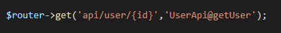
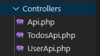
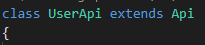
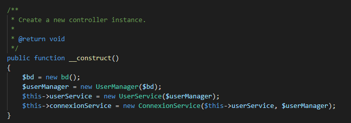
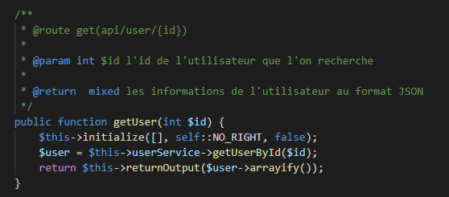
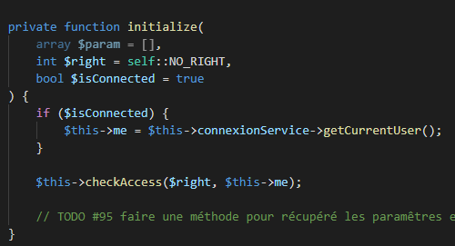
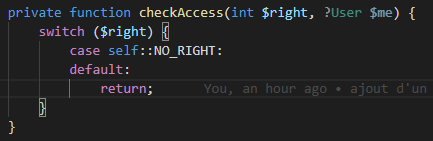

# Sommaire

```toc

```

## Etape 1 : écrire une nouvelle route API

Nous allons aller dans le fichier web.php dans le dossier NeoCracy\application\api\blog\routes\web.php 

Au format : $router->get('api/typededonné/{id}', "fichierAPI@methodeAUtiliser")


## Etape 2 : créer une nouvelle classes API

Disclaimer ! : Cette étape n'est pas nésséssaire si vous écrivers une API pour un type de classe éxistante 

Exemple de classe déjà présente : UserApi


Si la classe n'éxiste pas, il est l'heure de la créer. Pour cela il vous suffit de vous rendre dans le dossier NeoCracy\application\api\blog\app\Http\Controllers et de créer une nouveau fichier du doux nom de nomEntitéApi.php



Dans ce fichier, nous allons créer une classe qui extends la classe Api.



Maintenant, il vous faut préparé la méthode __construct. Cette méthode doit instancier les différents service et manager dont votre API a besoin pour fonctionner.


PS : ceci ne sera bientot plus utile car tout sera instancier en static dans la class Api.

## Etape 3 : Ecriture de notre méthode API

Nous allons commencer par écrire une méthode simple pour notre nouvelle API, celle si devrait être nommée simplement pour comprendre facilement sont utilité.



Pour commencer, nous allons écrire la documentation de la méthode,

@route correspont a la route utiliser par l'api, cela permet de savoir directement a quel API on a a faire

Ensuite, on écrit les parametres et le retour de la fonction afin de savoir ce que la méthode doit renvoyer

Une ceci fait, nous allons utiliser la méthode $this->initialize afin d'initialiser la requête. Cette méthode a pour principale utilité de préparé les paramêtres de la fonction, vérifier si l'utilisateur est connecté au besoin, et faire les check de permission.

Exemple de fonction Initialize : 
Cette fonction prend en paramêtre : 

    une array $param qui contient la liste des paramêtres a récupéré au format ["nom_du_composant" => TYPE_TYPE] (la liste de type sera disponible plus tard)

    un int qui correspond a un type de droit, les droits doivent être instancier sous forme de constante dans la classe.

    un booléen indiquant si il est nésséssaire d'être connecté pour utiliser l'api

    Disclaimer ! : d'autre paramêtre pourront être ajouté au fure et a mesure des besoins



Cette méthode utilise une méthode checkAccess() ayant pour utilité de faire les check de permission


Disclaimer ! : si c'est méthode sont déjà créer, vous pouvez rajouter des check de permission dans la fonction checkAccess en rajoutant des case.

Une fois le initialize fait, vous pouvez récupéré les informations que vous avez besoin via les services instancier précédament.

Enfin, il vous faudrais faire un return de la méthode $this->returnOutput(array) afin de renvoyer au format JSON les informations nésséssaire

PS : les informations pourront être reformater dans une méthode créer pour l'occasion

## Etape 4 : Tester votre API !

Il est maintenant l'heure de tester votre API afin de relever les potentiels érreur qui se serai glisser dans votre code (principalement l'écriture de service / manager)

Vous pourrez aussi tester avec différents utilisateur afin de tester vos méthodes de permission.

