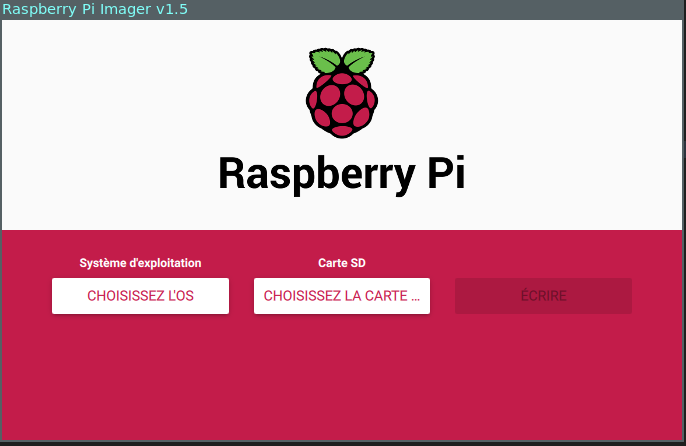
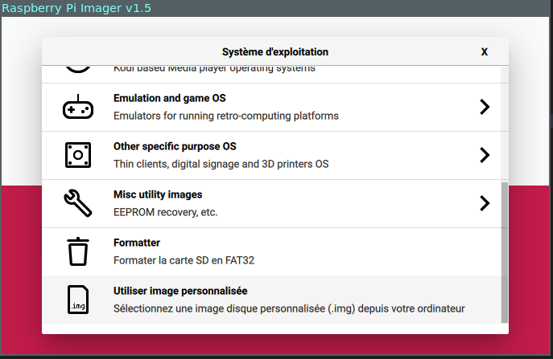
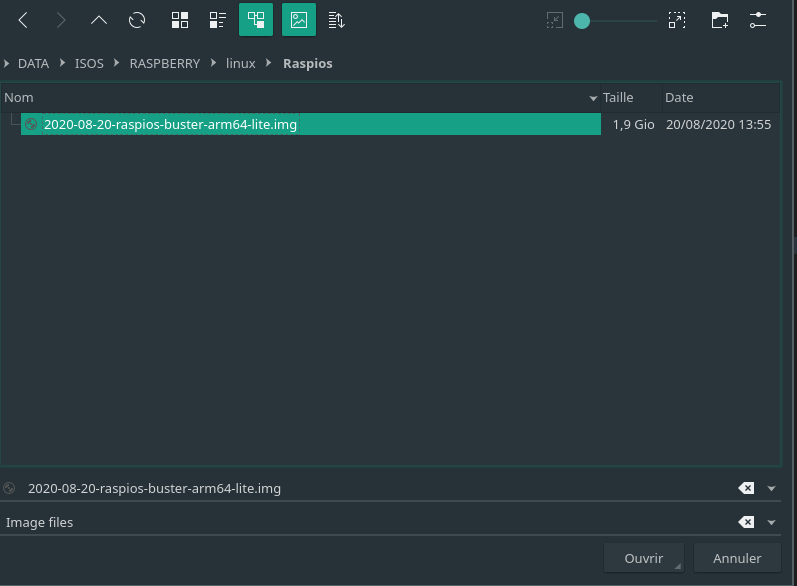
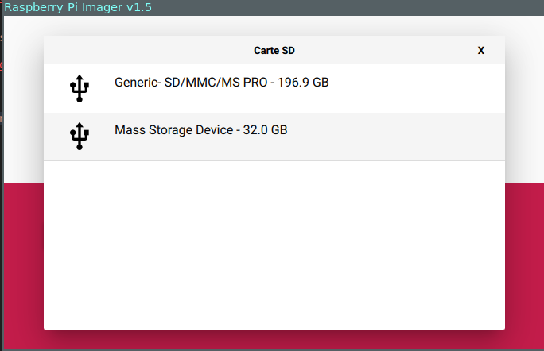
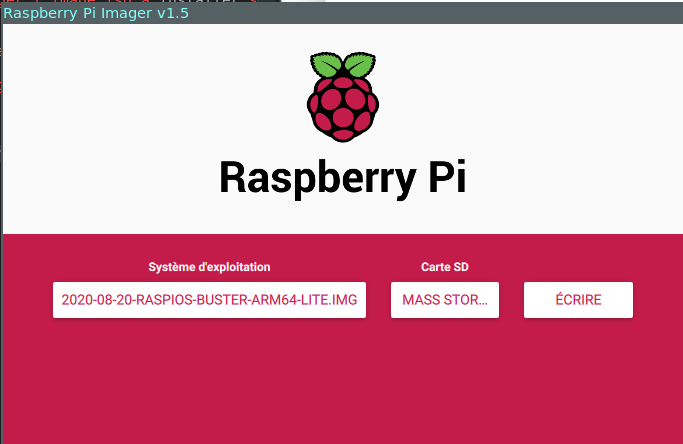
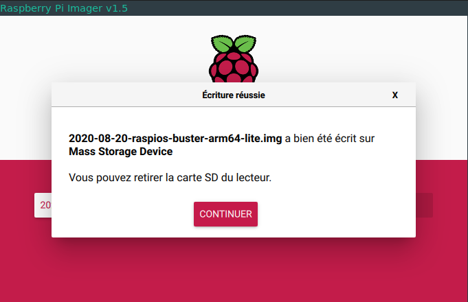
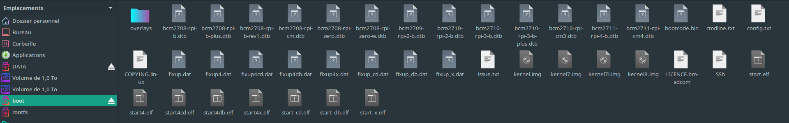
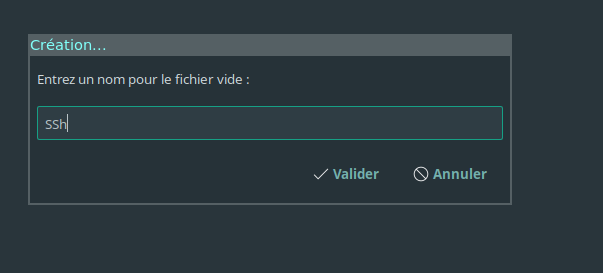
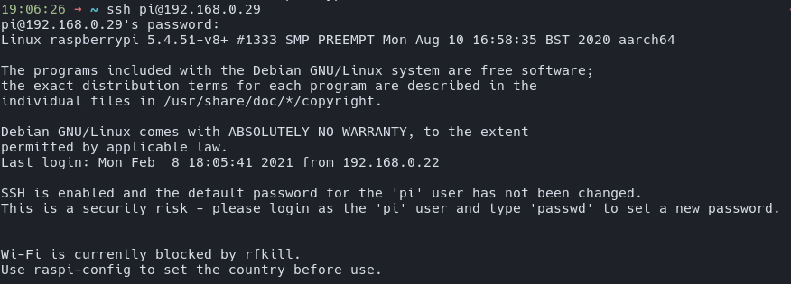

# Sommaire

```toc

```

## 1. Télecharger et installer Raspberry pi Imager

[lien ici](https://www.raspberrypi.org/software/)

## 2. Télécherger le systeme d'exploitation

Nous allons maintenant télécharger l'image iso à installer sur le raspberrypi

Nous téléchargerrons la version arm 64 Bit de raspios_lite :
[lien ici](https://downloads.raspberrypi.org/raspios_lite_arm64/images/raspios_lite_arm64-2020-08-24/)

## 3. Création de la carte sd bootable

On lance raspberrypi imager :
Ensuite on va choisir quel OS à installer en séléctionnant choisir l'os :


Puis utiliser une image personnalisée :


On va chercher notre image télécharger précedement :


On va ensuite séléctionner notre carte sd :



Puis on lance l'ecriture de l'image sur la carte sd en cliquant sur écrire


A la fin de l'écriture un message s'affiche, on clique sur continuer :


Maintenant que notre image à bien était écrit carte sd,on peut fermer raspberry pi Imager.
on eject puis on réinsere la carte sd pour afficher le contenu de la partition boot :


On créer un fichier ssh (! pas ssh.txt !!!) pour avoir acces au raspberry en ssh


ensuite il nous reste plus qu'a relier votre raspberry pi a votre box, inserer la carte sd dans le raspberry pi et se connecter en ssh avec :

```
ssh pi@raspberrypi
```

ou avec si vous connaissait l'addresse ip

```
ssh pi@192.168.0.29
```

par defaut :
login : pi
mot de passe : raspberry


