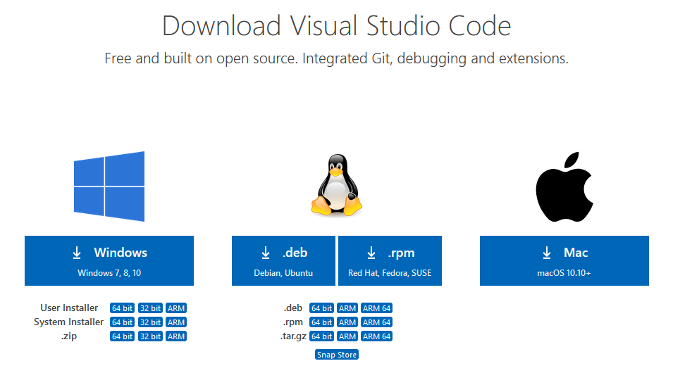
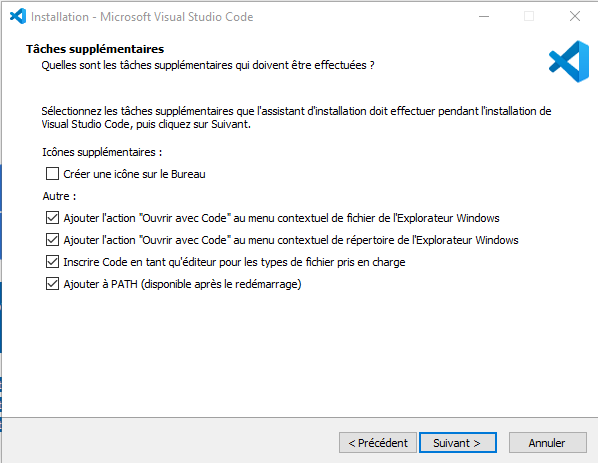
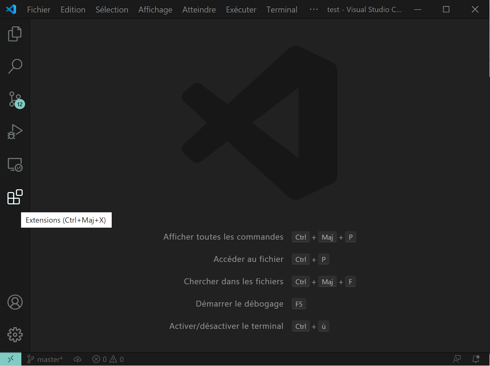
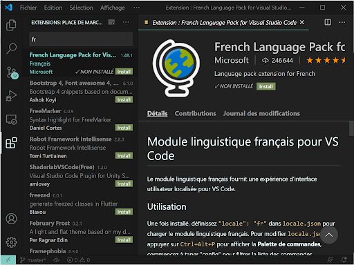
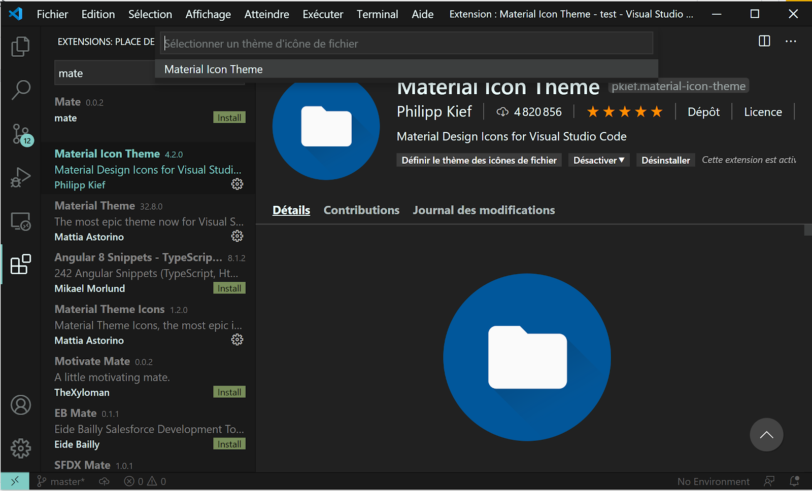
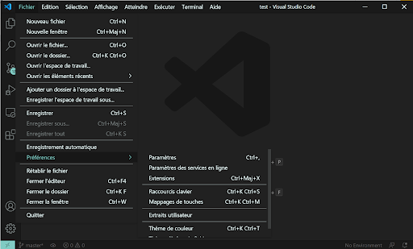
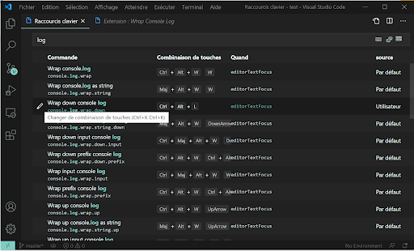
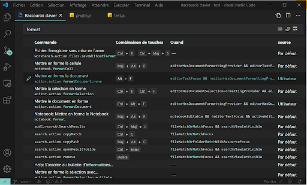

# Sommaire

```toc

```

## 1. Télecharger Vscode

[lien ici](https://code.visualstudio.com/Download)



## 2. installer Vscode

Une fois télécharger on le fichier d'installation.

N'oubliez pas de cocher les cases pour plus de facilité :



## 3. installation des plugins

Nous allons maintenant installer les extensions et configurer VS code pour un meilleur confort d'utilisation.
On ouvre VS code puis on clique sur l'icône des extensions.



### 1. Langue fr

On va installer le pack de langue fr
[language-pack-fr](https://marketplace.visualstudio.com/items?itemName=MS-CEINTL.vscode-language-pack-fr)
on entre “fr” dans la barre de recherche puis on installe.
cette extension nécessite un redémarrage de VS code.



### 2. Material themes

On va installer un theme pour vscode
[material-theme](https://marketplace.visualstudio.com/items?itemName=Equinusocio.vsc-material-theme)
On clique sur “Définir le thème de couleur”
puis on sélectionne “Material Theme Darker High Content”

[VSCODE](./img/01-Installer-Vscode/...)

### 3. Material icon theme

On fait la même chose pour les icones
[material-icon-theme](https://marketplace.visualstudio.com/items?itemName=PKief.material-icon-theme)
On clique sur “Définir le thème des icônes de fichier
puis on sélectionne “Material Icon Theme”



### 4. Bracket pair clorizer

On peut installer les extension suivantes :
[bracket-pair-colorizer-2](https://marketplace.visualstudio.com/items?itemName=CoenraadS.bracket-pair-colorizer-2)

### 5. StandardJS

[StandardJS](https://marketplace.visualstudio.com/items?itemName=chenxsan.vscode-standardjs)

### 6. Es7 react snippets

[es7-react-js-snippets](https://marketplace.visualstudio.com/items?itemName=dsznajder.es7-react-js-snippets)

## 4. Configuration des raccourcis

Nous allon voir la configurtion des raccourcis dans Vscode

Par exemple nous allons installer wrap-console-log
[wrap-console-log](https://marketplace.visualstudio.com/items?itemName=midnightsyntax.vscode-wrap-console-log)

On va maintenant configurer le raccourci
on clique sur fichier → Préférences → Raccourcis clavier
ou la commande Ctrl+K Ctrl+S



On entre log dans la barre de recherche puis on modifie “Wrap down consol log”



puis on entre un raccourcis, pour ma part j'utilise Ctrl+Alt+L

Wrap down consol log” fait apparaître le méthode “console.log()” sur l'élément sélectionné en dessous de celui-ci

```js
const text = "bonjour"
console.log(bonjour)
```

On fait de même pour format
puis on entre un raccourcis, pour ma part j'utilise Alt+F
cela permet de formater le code de tout le fichier


