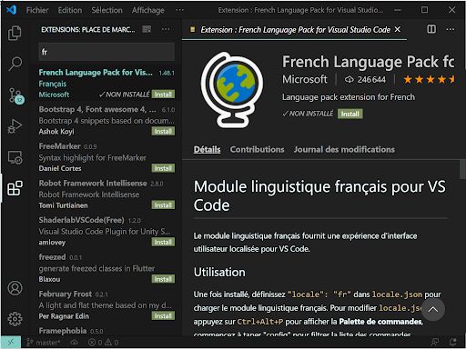

# Sommaire

```toc

```

## 1. Télecharger Vscode

[lien ici](https://code.visualstudio.com/Download)



## 2. Pour installer la version LTS de Node.js

On lance la commande suivante

```
nvm install --lts
```

Ensuite nous pouvons activer la version choisie

```
nvm use --lts
```

## 3. Pour installer la dernière Node.js

On lance la commande suivante

```
nvm install node
```

Ensuite nous pouvons activer la version choisis

```
nvm use node
```

## 4. Export de nvm dans le shell

Si vous utilisez zsh remplacer `.bashrc par .zshrc`

Les deux premieres lignes ajoutent nvm au fichier `.bashrc`

La troisième ligne permet l'autocompletion avec nvm

```
export NVM_DIR="$HOME/.nvm"
[ -s "$NVM_DIR/nvm.sh" ] && \. "$NVM_DIR/nvm.sh"
[ -s "$NVM_DIR/bash_completion" ] && \. "$NVM_DIR/bash_completion"
```

## 5. Passer de la version LTS à la dernière version

Nous avons maintenant la dernière version de Node.js ainsi que la version LTS (long term support) d'installer.
Nous
