# Sommaire

```toc

```

## 1. Installation des extensions dans vscode

D'abord nous allons installer les extensions Eslint et Prettier dans Vscode pour quelles soit reconnu dans notre editeur de code.
[Prettier](https://marketplace.visualstudio.com/items?itemName=esbenp.prettier-vscode)
[Eslint](https://marketplace.visualstudio.com/items?itemName=dbaeumer.vscode-eslint)

Si vous ne savez pas comment installer d'extension ou si vous n'avez pas Vscode vous pouvez suivre ce [tutoriel](https://neocracyblog.herokuapp.com/fr/Vscode/01-Installer-Vscode/)

## 2. création d'un projet

Pour configurer Eslint et Prettier il faut avoir un package.json afin de pouvoir uttiliser Node.js

Ce qui permettra d'installer des packages npm pour votre projet.

Pour créer un fichier package.json, si vous n'en avez pas,
On va ouvrir un terminal dans VS code en cliquant sur Terminal → New Terminal

le terminal se situe au niveau dans notre dossier racine dans vscode

puis on entre la commande :

```
npm init
```

## 3. Installation des modules eslint et prettier

Une fois que nous avons notre package.json
On entre cette commande qui installe les package eslint et prettier
avec -D, --save-dev: le Package sera installé dans devDependencies

```
npm install --save-dev eslint prettier
```

ou la commande raccourci

```
npm i -D eslint prettier
```

## 2. Configuration d'eslint

ensuite nous allons initaliser la configuration d'Eslint avec la commande :

```
npx eslint --init
```

Cette commande lance un script interactif, voici un exemple de configuration :

Comment voulez vous uttiliser Eslint ?
Verifier la syntaxe trouver les problemes et linter le style de code :
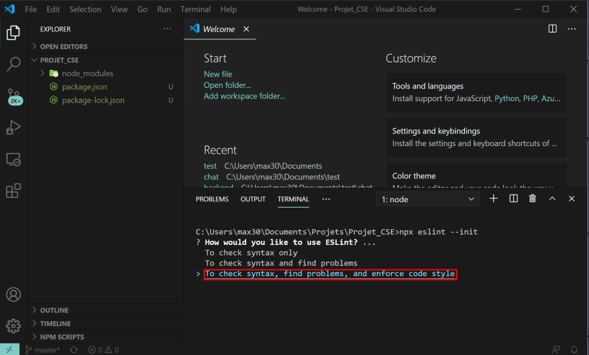

Quel type de modules uttilisez vous dans votre projet ?
Javascript :
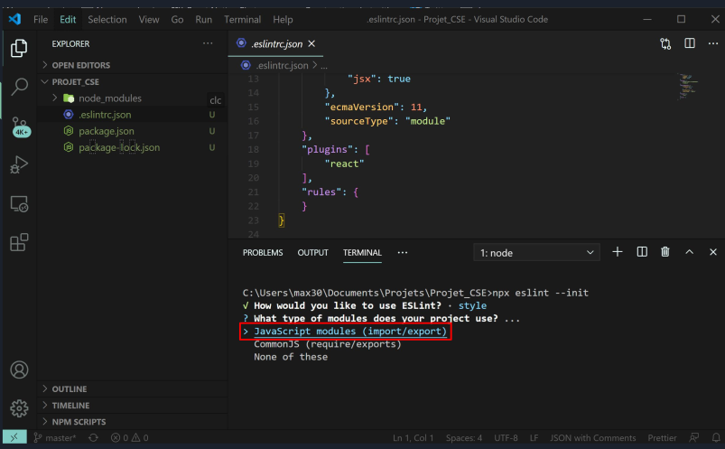

Quel framework uttilisez vous dans votre projet ?
React :
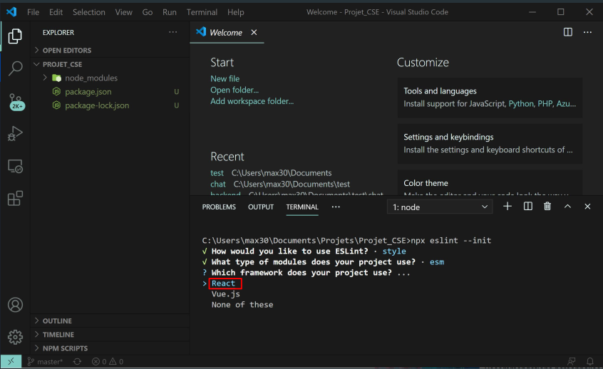

Est-ce que votre projet utilise TypeScript ?
No :
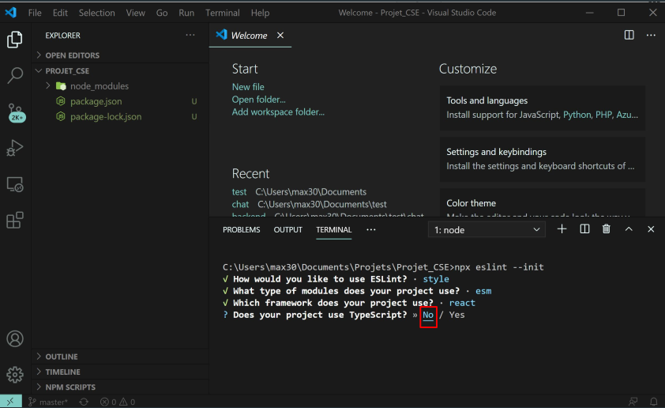

Ou est-ce que votre code sera lancer ?
Dans un navigateur :
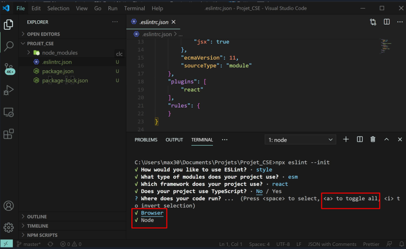

Comment voulez vous definire votre style de code ?
Utiliser un style populaire :
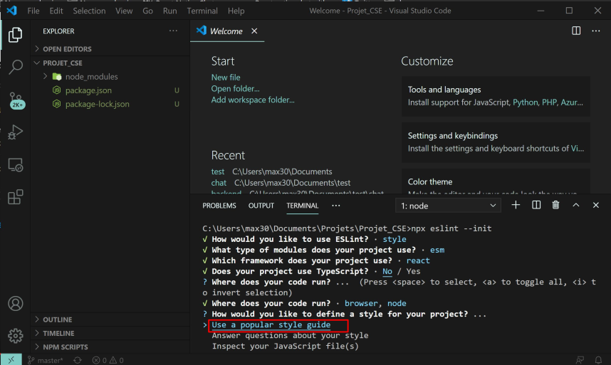

Quel type de style voulez vous uttilisez ?
StandardJS :
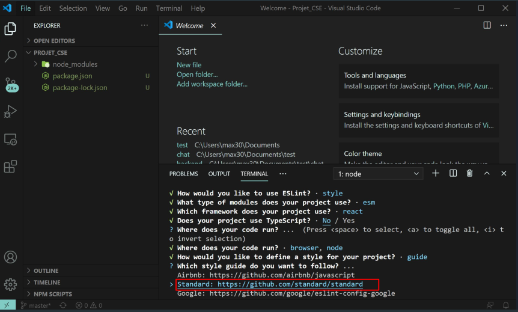

Sous quel format voulez vous votre config ?
Json :
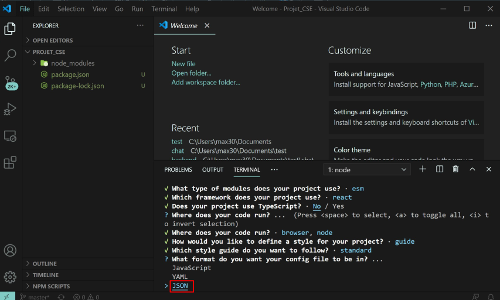

Voulez vous installer votre configuration avec npm ?
Yes :
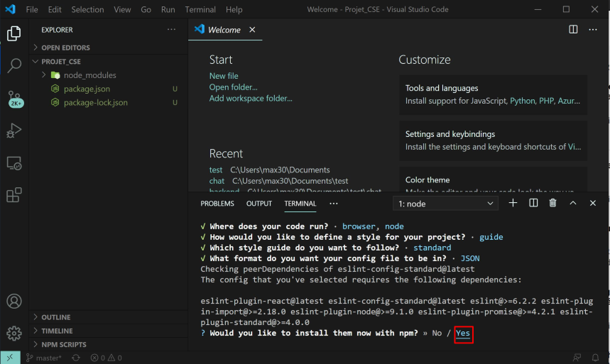

Une fois la configuration Installer on peut afficher la configuration d'eslint depuis le fichier .eslint.json :
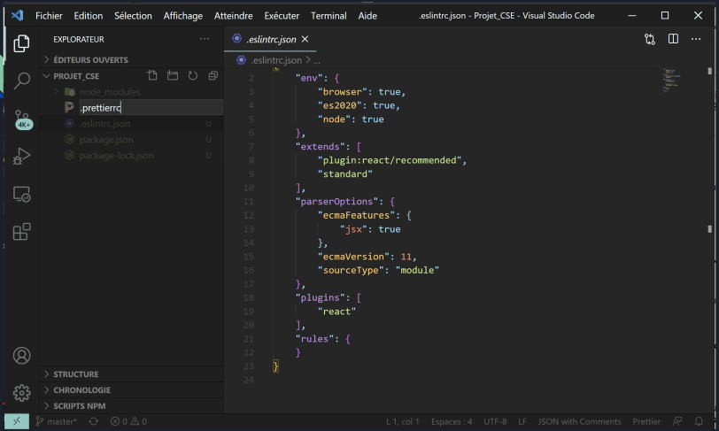

## 3. Configuration de prettier

Maintenant nous allons voir la configuration de Prettier

Pour cela on créer le fichier .prettierrc
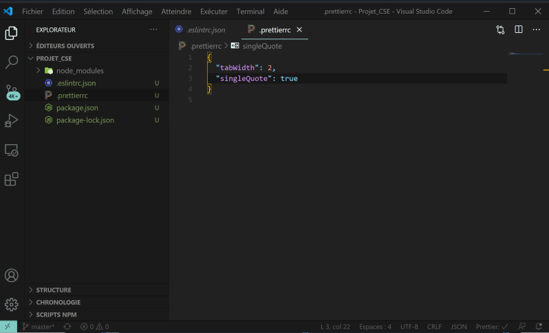

Pour éviter les problemes avec la configuration de Vscode
on crée un dossier .vscode dans lequel on crée le fichier setting.json avec la configuration suivante :

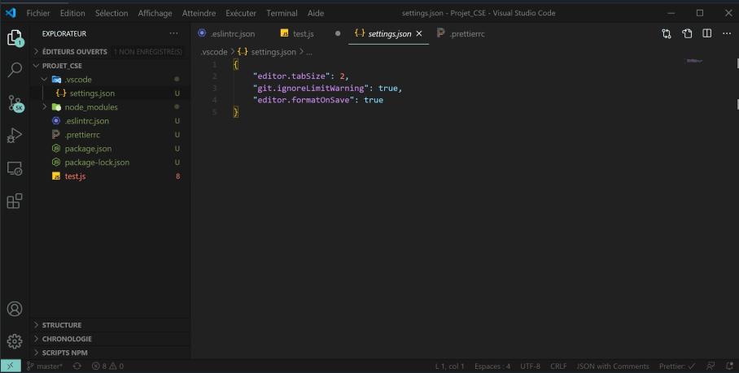

Nous pouvons maintenant tester notre configuration en créant un fichier test.js dans notre projet :

On insère du code non formater par exemple :

```js
function toggle(elementID) {
  var elem = document.getElementById(elemID)

  if (elem.style.display === "block") {
    elem.style.display = "none"
  } else {
    elem.style.display = "block"
  }
}
toggle()
```

Vscode reconnais que nous avons ESLINT d'installé, on authorise vscode à utiliser eslint :
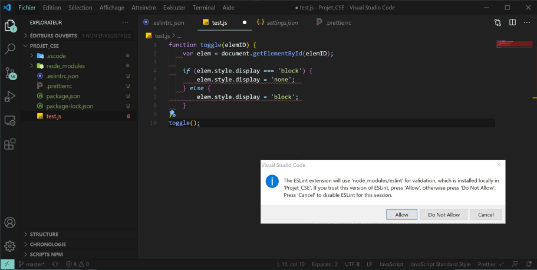

On peut voir que eslint lint automatiquement le code que nous avons ecrit :
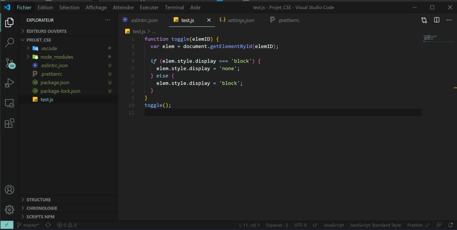
